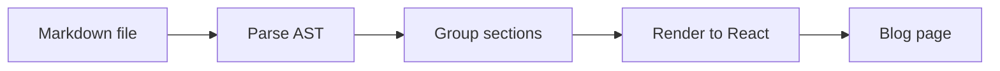

# blogkit-md

A Next.js tool that converts standard markdown files into rendered blog posts for [`@san-siva/blogkit`](https://blogkit.santhoshsiva.dev).

> This README is automatically rendered as a live demo at [blogkit-md.santhoshsiva.dev](https://blogkit-md.santhoshsiva.dev)

## Getting started

```bash
git clone https://github.com/san-siva/blogkit-md.git
npm install
```

### Dev server

```bash
npm run dev                          # uses data/test.md by default
npm run dev -- --file=data/my-post.md  # specify a markdown file
```

The dev server watches the markdown file for changes and auto-reloads the browser via HMR.

### Build

```bash
npm run build
npm run start
```

### Lint

```bash
npm run lint   # check
npm run fix    # auto-fix
```

## Using BlogPost in your own Next.js app

`blogkit-md` exposes a `BlogPost` server component you can drop into any Next.js project.

### Install

```bash
npm install @san-siva/blogkit-md
```

Or as a local package:

```json
"@san-siva/blogkit-md": "file:../blogkit-md"
```

Add it to `transpilePackages` in your `next.config.ts`:

```ts
const nextConfig = {
	transpilePackages: ['@san-siva/blogkit-md'],
};
```

### Usage

```tsx
import { BlogPost } from '@san-siva/blogkit-md';

export default function Page() {
	return (
		<BlogPost
			filePath="content/my-post.md"
			jsonLd={{
				'@context': 'https://schema.org',
				'@type': 'BlogPosting',
				headline: 'My Post',
				description: 'Post description',
				datePublished: '2026-01-01',
				author: { '@type': 'Person', name: 'Your Name' },
			}}
		/>
	);
}
```

### Props

| Prop       | Type                 | Required | Description                                                                  |
| :--------- | :------------------- | :------: | :--------------------------------------------------------------------------- |
| `filePath` | `string`             |   Yes    | Path to the markdown file. Relative paths are resolved from `process.cwd()`. |
| `jsonLd`   | `WithContext<Thing>` |    No    | Optional JSON-LD schema passed to `<Blog>` for structured data / SEO.        |

## Supported markdown features

| Feature              | Syntax                                 |
| -------------------- | -------------------------------------- |
| Headings             | `# H1` `## H2` `### H3` `#### H4`      |
| Paragraph            | Plain text                             |
| Hard line break      | Two spaces at end of line              |
| Bold                 | `**bold**`                             |
| Italic               | `_italic_`                             |
| Inline code          | `` `code` ``                           |
| Link                 | `[text](url)`                          |
| Image                | ``                          |
| Ordered list         | `1. item`                              |
| Unordered list       | `- item`                               |
| Table                | GFM table syntax                       |
| Code block           | ` ```lang `                            |
| Mermaid diagram      | ` ```mermaid `                         |
| Thematic break       | `---`                                  |
| Blockquote           | `> text` — renders as info callout     |
| Blockquote (warning) | `> ~text` — renders as warning callout |
| Blockquote (error)   | `> !text` — renders as error callout   |

## Philosophy

### Not Your Average Markdown Viewer

If you're looking for a strictly standard, 1:1 markdown renderer, `blogkit-md` might not be what you expect.

<mark>Instead of building just another plain document viewer, intentional design liberties have been taken to render markdown as **beautiful, engaging blog posts**.</mark>

Documentation shouldn't be a wall of boring text. The goal of this tool is to make reading technical docs, articles, and guides an exciting and visually pleasing experience.

### Key Differences

|                | blogkit-md                                               | Plain markdown renderer |
| -------------- | -------------------------------------------------------- | ----------------------- |
| **Output**     | Styled blog post                                         | Raw document            |
| **Typography** | Optimized for long-form reading                          | Unstyled                |
| **Ecosystem**  | Built for [Blogkit](https://github.com/san-siva/blogkit) | Generic                 |

## Architecture

The markdown file is parsed into an AST using `remark-parse` + `remark-gfm`, then transformed into React components from `@san-siva/blogkit`.



## How Markdown Translates to Blog Sections

### Headings as Layout Triggers

In `blogkit-md`, headings aren't just for changing font sizes—**they are the architectural blueprint for your post**. Each heading level acts as a layout trigger, directly controlling how `BlogSection` components are generated, nested, or promoted.

| Markdown                 | Layout Behavior                                                                                                                                            |
| :----------------------- | :--------------------------------------------------------------------------------------------------------------------------------------------------------- |
| `# H1`                   | **Page Title.** Sets the main article title. Does not generate a structural section block.                                                                 |
| `## H2`                  | **Main Section.** Creates a new, top-level `BlogSection`.                                                                                                  |
| `### H3`                 | **Subsection.** Nests cleanly within the currently active `H2` section.                                                                                    |
| `#### H4`                | **Section Break.** Renders as a bold line, but acts as a layout trigger: it forces the _next_ `H3` to break out and become a brand-new, top-level section. |
| `##### H5` & `###### H6` | **Inline Emphasis.** Renders as a bold line within the current section or subsection without altering the page layout.                                     |

> Standard content—such as paragraphs, lists, and code blocks—automatically flows into the most recently opened section or subsection.

### Special Layout Rules

Because `blogkit-md` is optimized for blog readability, it includes smart fallbacks to ensure your layout looks great even in edge cases:

| Rule                                                 | Behavior                                                                                                                                                                                                              |
| ---------------------------------------------------- | --------------------------------------------------------------------------------------------------------------------------------------------------------------------------------------------------------------------- |
| Strictly Deepening Hierarchy                         | Headings within a section must always go deeper (e.g., `H2 → H3 → H4`). If the hierarchy reverses—like an `H3` appearing after an `H4`—the nesting breaks, and the `H3` is promoted to a brand-new top-level section. |
| `H1` loses structural significance if not at the top | If an `H1` appears anywhere other than the very top of the document, it does not create a page title. Instead, it is treated as stylized text and rendered as a section break.                                        |
| Intro section                                        | Any text written before the first heading—or directly beneath the `# H1` page title—is automatically grouped into an untitled, top-level BlogSection                                                                  |

### Visualizing the Structure

Let's put those layout rules into practice. Here is how a standard markdown document translates into a blog layout:

```markdown
# My Awesome Blog Post

This text becomes the Preamble (an untitled, top-level section).

## The Setup

Some content goes here.

### Prerequisites

Nested content belongs here.

## The Execution

#### Note on performance:

### The Results
```

Here is how the parser breaks the above document down into isolated React components:

##### Intro section

```markdown
This text becomes an introductory, untitled section.
```

##### Section 1

```markdown
## The Setup

Some content goes here.

#### Prerequisites

Nested content belongs here.
```

##### Section 2

```markdown
## The Execution

#### Note on performance:
```

##### Section 3

```markdown
## The Results
```

### Callouts

Blockquotes are rendered as styled callout banners. The callout type is controlled by a prefix on the first word of the quote:

| Syntax    | Callout Type | Example                      |
| :-------- | :----------- | :--------------------------- |
| `> text`  | Info         | `> This is an info callout.` |
| `> ~text` | Warning      | `> ~This is a warning.`      |
| `> !text` | Error        | `> !This is an error.`       |

The prefix character is stripped from the rendered output — only the callout style changes.

## Want more customization?

`blogkit-md` is just one piece of the puzzle. If you want to customize the underlying React components, tweak the UI, or take full control over your blog's layout, dive into the official [Blogkit documentation](https://blogkit.santhoshsiva.dev/).

## License

`blogkit-md` is open source software licensed under the [MIT license](https://github.com/san-siva/blogkit-md/blob/main/LICENSE).  
Contributions are welcome!

## About

- **Author:** [Santhosh Siva](https://www.santhoshsiva.dev)
- **License:** [MIT](https://github.com/san-siva/blogkit-md/blob/main/LICENSE)
