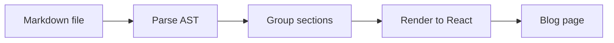

A React component library that converts markdown files into rendered blog posts for [`@san-siva/blogkit`](https://blogkit.santhoshsiva.dev).

> Live preview of this README is available here [blogkit-md.santhoshsiva.dev](https://blogkit-md.santhoshsiva.dev)

## Getting started

`blogkit-md` exposes a `BlogPost` server component you can drop into any Next.js project.

### Install

```bash
npm install @san-siva/blogkit-md
```

### Usage

```tsx
import { BlogPost } from '@san-siva/blogkit-md';

export default function Page() {
	return (
		<BlogPost
			filePath="content/my-post.md"
			jsonLd={{
				'@context': 'https://schema.org',
				'@type': 'BlogPosting',
				headline: 'My Post',
				description: 'Post description',
				datePublished: '2026-01-01',
				author: { '@type': 'Person', name: 'Your Name' },
			}}
		/>
	);
}
```

### Props

| Prop       | Type                 | Required | Description                                                                  |
| :--------- | :------------------- | :------: | :--------------------------------------------------------------------------- |
| `filePath` | `string`             |   Yes    | Path to the markdown file. Relative paths are resolved from `process.cwd()`. |
| `jsonLd`   | `WithContext<Thing>` |    No    | Optional JSON-LD schema passed to `<Blog>` for structured data / SEO.        |

### Frontmatter

Set the page title and description via a YAML frontmatter block at the top of your markdown file:

```yaml
---
title: My Post Title
description: A short description shown below the title
---
```

| Field         | Description                             |
| :------------ | :-------------------------------------- |
| `title`       | Renders as the `BlogHeader` page title  |
| `description` | Renders as the `BlogHeader` description |

## Supported markdown features

| Feature              | Syntax                                         |
| -------------------- | ---------------------------------------------- |
| Frontmatter          | `---` YAML block — sets `title`, `description` |
| Section title        | `# H1` `## H2` — top-level section             |
| Subsection title     | `### H3` — nested section                      |
| Bold line            | `#### H4` `##### H5` `###### H6`               |
| Paragraph            | Plain text                                     |
| Hard line break      | Two spaces at end of line                      |
| Bold                 | `**bold**`                                     |
| Italic               | `_italic_`                                     |
| Inline code          | `` `code` ``                                   |
| Link                 | `[text](url)`                                  |
| Image                | ``                                  |
| Ordered list         | `1. item`                                      |
| Unordered list       | `- item`                                       |
| Table                | `\| col \| col \|` — headers and rows only     |
| Code block           | ` ```lang `                                    |
| Mermaid diagram      | ` ```mermaid `                                 |
| Thematic break       | `---`                                          |
| Blockquote           | `> text` — renders as info callout             |
| Blockquote (warning) | `> ~text` — renders as warning callout         |
| Blockquote (error)   | `> !text` — renders as error callout           |

## Philosophy

### Not Your Average Markdown Viewer

If you're looking for a strictly standard, 1:1 markdown renderer, `blogkit-md` might not be what you expect.

<mark>Instead of building just another plain document viewer, intentional design liberties have been taken to render markdown as **beautiful, engaging blog posts**.</mark>

Documentation shouldn't be a wall of boring text. The goal of this tool is to make reading technical docs, articles, and guides an exciting and visually pleasing experience.

### Key Differences

|                | blogkit-md                                               | Plain markdown renderer |
| -------------- | -------------------------------------------------------- | ----------------------- |
| **Output**     | Styled blog post                                         | Raw document            |
| **Typography** | Optimized for long-form reading                          | Unstyled                |
| **Ecosystem**  | Built for [Blogkit](https://github.com/san-siva/blogkit) | Generic                 |

## Architecture

The markdown file is parsed into an AST using `remark-parse` + `remark-gfm`, then transformed into React components from `@san-siva/blogkit`.



## How Markdown Translates to Blog Sections

### Headings as Layout Triggers

In `blogkit-md`, headings aren't just for changing font sizes — **they are the architectural blueprint for your post**.

| Markdown                         | Layout Behavior                                                                              |
| :------------------------------- | :------------------------------------------------------------------------------------------- |
| `# H1` & `## H2`                 | **Top-level section.** Creates a new `BlogSection`.                                          |
| `### H3`                         | **Subsection.** Nests within the active H1/H2 section. Promoted to top-level if none exists. |
| `#### H4` `##### H5` `###### H6` | **Bold line.** Rendered as styled text inside the current section — no layout effect.        |

> Standard content — paragraphs, lists, code blocks — flows into the most recently opened section or subsection.

### The Nesting Logic

The layout is determined entirely by heading level (depth):

- **Deeper heading (level up):** If a heading has a higher number than the current one (e.g. `### H3` after `## H2`), it creates a nested subsection inside the current section.
- **Equal or shallower heading (level down):** If a heading has a number equal to or lower than the current one (e.g. `## H2` after another `## H2`), it closes the current section and starts a new one at the appropriate level.
- **Initial content:** Any content before the very first heading is grouped into an automatic untitled intro section.

### Visualizing the Structure

Here is how a standard markdown document maps to blog layout:

```markdown
Intro content

## The Setup

Some content goes here.

### Prerequisites

Nested content belongs here.

## The Execution

Some more content.

### The Results

Result content.

# A Note

### A Subsection

## Also Nested
```

Here is how the parser breaks the above document down into isolated React components:

##### Intro section

```markdown
Intro content
```

##### Section 1

```markdown
## The Setup

Some content goes here.

### Prerequisites

Nested content belongs here.
```

##### Section 2

```markdown
## The Execution

Some more content.

### The Results

Result content.
```

##### Section 3

```markdown
# A Note

### A Subsection

## Also Nested
```

> `## Also Nested` does not start a new top-level section. Because it appears after a `### H3` inside an `# H1`, the parser backtracks to the H1 and nests the H2 beneath it.

### Callouts

Blockquotes are rendered as styled callout banners. The callout type is controlled by a prefix on the first word of the quote.

> This is an info callout. Use `> text` for general information.

> ~This is a warning callout. Use `> ~text` to flag caution.

> !This is an error callout. Use `> !text` for errors or destructive actions.

The prefix character is stripped from the rendered output — only the callout style changes.

## Want more customization?

`blogkit-md` is just one piece of the puzzle. If you want to customize the underlying React components, tweak the UI, or take full control over your blog's layout, dive into the official [Blogkit documentation](https://blogkit.santhoshsiva.dev/).

### License

`blogkit-md` is open source software licensed under the [MIT license](https://github.com/san-siva/blogkit-md/blob/main/LICENSE).  
Contributions are welcome!

### About

- **Author:** [Santhosh Siva](https://www.santhoshsiva.dev)
- **License:** [MIT](https://github.com/san-siva/blogkit-md/blob/main/LICENSE)
